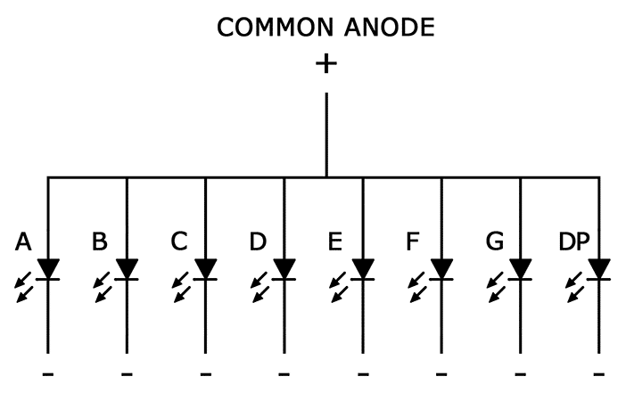
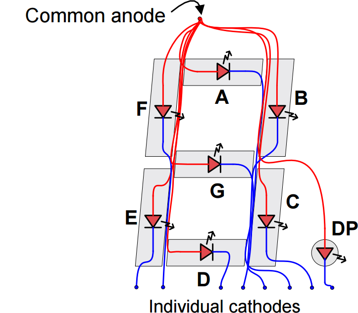

### Afisaj cu 7 Segmente

Afisajele cu 7 segmente sunt formatate din 7 LED-uri (sau 8, dacă includem și punctul), legate fie în modul anod comun, fie în modul catod comun. Fiecare segment este controlat individual pentru a forma cifre sau caractere.



#### Funcționare:
- **LED** (Light Emitting Diode) este alcătuită dintr-un anod (+) și un catod (-).
- Pentru ca LED-ul să funcționeze, tensiunea la anod trebuie să fie mai mare decât la catod.
- În logica digitală, tensiunea de anod este de obicei 5V (1 logic), iar pentru aprinderea LED-ului, tensiunea de catod trebuie să fie 0V (0 logic).

#### Exemplu de Modul Verilog pentru Controlul unui LED:
```verilog
module setLed (
    output A, // fir conectat la catodul ledului A
    output AN // fir conectat la tranzistorul PNP ce controlează anodul ledului A
);
 
assign AN = 0; // Pentru a aprinde ledul A:
assign A = 0;
assign A = 1; // Pentru a stinge ledul
 
endmodule
```

### Multiplexare

Pentru a controla multiple cifre, se utilizează o tehnică de multiplexare:

- **Anod comun**: Un anod este comun pentru toate cele 7 segmente ale unei cifre.
- **Partajarea catodului**: Catodii segmentelor sunt partajați între toate cifrele afișajului.



Prin activarea unui singur anod la un moment dat și controlarea corespunzătoare a catodilor, se poate afișa o cifră specifică. Procesul de afișare a cifrelor diferite este atât de rapid încât ochiul uman percepe un afișaj continuu.

### Task-uri în Verilog

Utilizarea task-urilor în Verilog permite:
- crearea de cod reutilizabil și ușor de înțeles, similare cu funcțiile din C/C++
- delay-uri
-  manipularea variabile globale sau locale și pot folosi atribuiri blocante și non-blocante
