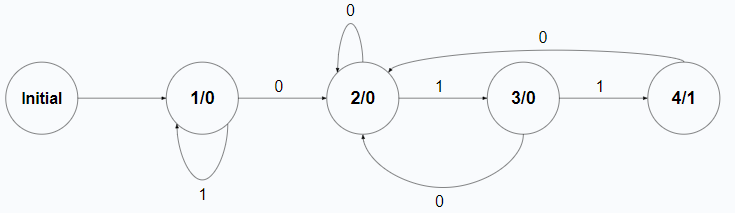

# Automate Finite (FSM)

## Prezentare Generală

Automatele Finite (FSM), cunoscute și ca Automate Finite Secvențiale, sunt folosite pentru proiectarea diverselor programe sau circuite secvențiale. Acestea modelează fluxuri de execuție și au un număr finit de stări între care pot trece pe baza unor condiții prestabilite.

### Caracteristici ale FSM:
- Modelează un sistem cu un număr finit de stări.
- Numai una dintre aceste stări poate fi activă la orice moment de timp.
- Schimbă starea activă în funcție de anumite condiții.

## Tipuri de Automate Finite

### Automat Mealy
- Ieșirea depinde de starea curentă și de intrarea curentă.
- Exemplu de tranzitie: "Din A cu input-ul 0, trec în B și scot la ieșire 0"

### Automat Moore
- Ieșirea este determinată exclusiv de starea în care se află, independent de intrare.

## Implementarea Automatelor Finite

Pentru implementarea unui automat finit este esențială memorarea stării curente. Există mai multe metode de codificare a stărilor:

### Metode de Codificare a Stărilor
- **Numărare Efectivă în Binar**: Stările sunt numărate de la 0000, 0001 ... până la 1111 pentru o codificare pe 4 biți.
- **Codul Gray**: Stările consecutive diferă prin schimbarea unui singur bit (ex: 0000, 0001, 0011, 0010 ...).
- **Codul One-Hot**: Fiecare stare este reprezentată printr-un bit activ (hot) într-un registru, restul biților fiind 0 (ex: 0010 reprezintă starea a doua din patru posibile).
- **Codul One-Cold**: Similar cu one-hot, dar valorile sunt inversate (ex: 1101 reprezintă starea a doua).

## Exemplu de Automat Finit
- Generarea unei ieșiri de 1 când recunoaște secvența 011.
- Există o stare inițială definită.
- Prezintă două ieșiri (0 sau 1).
- Include stări cu tranzitii înapoi către ele însăși.
- Conține 5 stări, necesitând codificare pe 3 biți (2^2 <= 5 <= 2^3).


### Implementarea unui FSM în Verilog
- **Codificarea Stărilor**: Se determină numărul minim de biți necesari pentru reprezentarea stărilor.
- **Stare Inițială**: Este recomandat să se definească o stare inițială.
- **Nume Sugestive pentru Stări**: Exemplu: STATE_INITIAL, STATE_1, etc.
- **Comportamentul Ieșirilor**: Se definește comportamentul ieșirilor în funcție de stări și intrări.

#### Exemplu de Cod Verilog pentru Ieșire pe 1 Bit
```verilog
output wire o_w_out;

// Ieșire pe 1 bit
assign o_w_out = (l_r_currentState == STATE_4);
```

### Logica Secvențială de Tranziție După Ceas
- Starea se modifică doar pe frontul pozitiv al impulsului de ceas.
- Starea următoare este determinată de logica combinațională a automatului.

#### Exemplu de Schimbare a Stărilor în Verilog
```verilog
always @(posedge i_w_clk) begin
    if (Reset)
        l_r_currentState <= STATE_Initial;
    else
        l_r_currentState <= l_r_nextState;
end

always @(*) begin
    l_r_nextState = l_r_currentState;

    case (l_r_currentState)
        STATE_Initial: begin
            l_r_nextState = STATE_1;
        end
        STATE_1: begin
            if (!i_w_in)
                l_r_nextState = STATE_2;
        end
        STATE_2: begin
            if (i_w_in)
                l_r_nextState = STATE_3;
        end
        STATE_3: begin
            if (i_w_in)
                l_r_nextState = STATE_4;
        end
