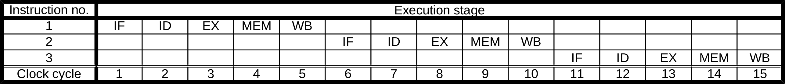
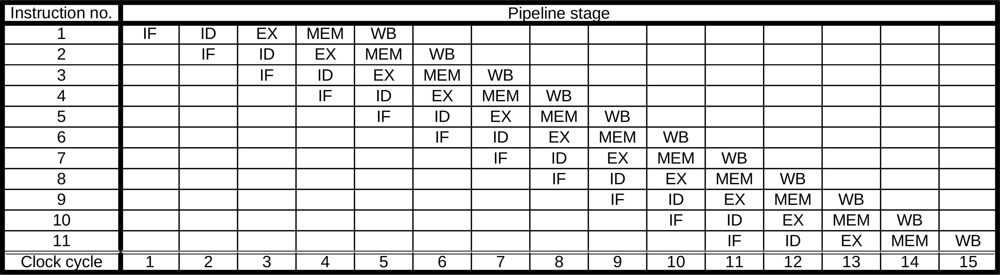

### Instructiuni

#### 1. Fazele Execuției unei Instrucțiuni
Conform arhitecturii RISC:

- **Instruction Fetch (IF)**: Instrucțiunea este adusă din memorie într-un registru de procesor.
- **Instruction Decode (ID)**: Instrucțiunea este decodificată pentru a determina unitățile și datele necesare execuției.
- **Execute (EX)**: Se execută acțiunea specificată de instrucțiune.
- **Memory Access (MEM)**: Se accesează memoria de date, dacă este necesar.
- **Register Write Back (WB)**: Se scriu datele în registrele de procesor, dacă este necesar.

#### 2. Pipelining
Pipelining-ul permite ca o instrucțiune să fie în fiecare stagiu la un moment dat, reducând semnificativ timpul de execuție al unui program.

- **Execuția fără pipeline**: Secvențială, fiecare instrucțiune începe după finalizarea celei anterioare.

- **Execuția în pipeline**: O instrucțiune poate fi în stadiul EX în timp ce alta este în ID sau IF, etc.



***Execuția fiecărei instrucțiuni în parte durează la fel de mult ca în varianta fără pipeline, însă execuția programului durează mai puțin.***

#### 3. Hazarde în Pipeline
Problemele sau "hazardele" apar din suprapunerea execuției instrucțiunilor în pipeline.

##### 3.1. Hazarde de Date
Situații unde instrucțiunile nu pot fi executate secvențial fără intervenții datorită dependenței de date:

- **Read After Write** `RAW` : O instrucțiune are nevoie de un rezultat care nu a fost încă calculat.
  - Exemplu:
    ```asm
    R2 <- R1 + R3 // R2 este calculat
    R4 <- R2 + R2  // R4 trebuie sa citeasca R2 dupa ce a fost calculat
    ```
- **Write After Read** `WAR`: mai puțin relevant pentru arhitecturi cu mai multe unități de execuție.
- **Write After Write** `WAW`: mai relevant pentru arhitecturi cu mai multe unități de execuție.

##### 3.2. Hazarde Structurale
Apar când două instrucțiuni vor să folosească aceeași resursă hardware simultan.

##### 3.3. Hazarde de Control
Se întâmplă când instrucțiunile de salt modifică fluxul de execuție, posibil introducând instrucțiuni greșite în pipeline.

#### Soluții pentru Hazarde
- **Bubbling**: Introduce cicli de întârziere în pipeline pentru a rezolva dependențele.
- **Forwarding**: Transferă datele necesare direct între stagiile pipeline-ului.
- **Branch Prediction**: Unități specializate prevăd și gestionează salturile pentru a minimiza întârzierile.
