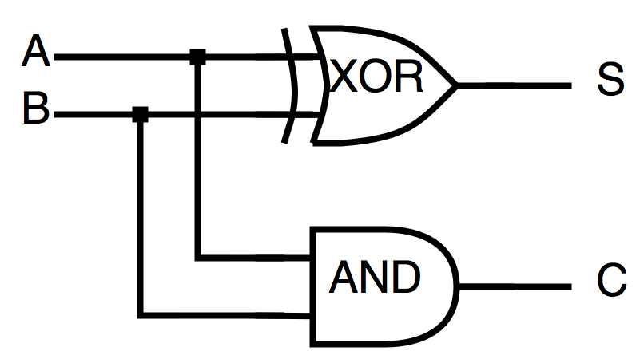
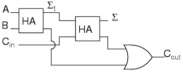
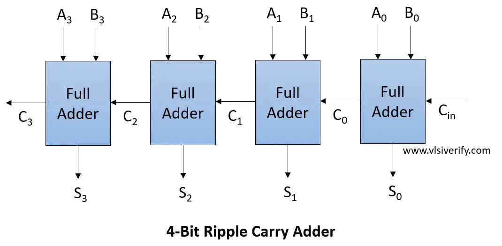
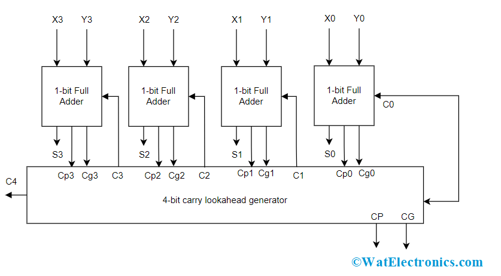

# Sumatoare și Operații cu Biți

Explorăm diferite tipuri de sumatoare și operațiile pe biți asociate, esențiale pentru înțelegerea și implementarea circuitelor digitale în calculatoare.

## Complementul lui 2
Complementul lui 2 este o metodă utilizată pentru a reprezenta numerele negative în sistemele binare:

- **Primul bit** din reprezentare este bitul de semn.
- **Negarea** fiecărui bit.
- **Adăugarea unei unități** la rezultat (ignorând overflow).

### Exemplu:
- 6 = 0110
- Negare biți: 1001
- Adăugăm 1: 1010
- Verificare: 1010 = −(1×2³) + (0×2²) + (1×2¹) + (0×2⁰) = -8 + 0 + 2 + 0 = −6

## Tipuri de Sumatoare

### Half-Adders
Realizează suma a doi operanzi pe un singur bit, generând suma \( S \) și transportul pentru nivelul următor \( C \).

### Full-Adders
Sumă a doi operanzi ținând cont și de transportul din rangul inferior. Poate fi implementat folosind un half-adder.

### Ripple-Carry Adder
Utilizează:
- \( n \) sumatoare de tip full-adder, cu primul carry conectat întotdeauna la 0.
- \( n-1 \) sumatoare de tip full-adder și un half-adder (primul din serie).
- Carry-in al sumatorului \( i \) este conectat la carry-out al sumatorului \( i-1 \) (C_in(i + 1) = C_out(i), C_in(0) = 0).
- Ineficient deoarece fiecare sumator așteaptă rezultatul sumatorului anterior.

### Scazatoare
Folosește un sumator:
- Fie \( B = \tilde{B} + 1 \), \( C_{in} = 0 \)
- Fie \( B = \tilde{B} \), \( C_{in} = 1 \)

### Carry-Look-Ahead Adder
- \( C(i + 1) = A(i) \cdot B(i) + C(i) \cdot (A(i) \oplus B(i)) \)
- Un sumator fie va genera un bit sau va propaga carry-ul anterior.
- \( C_{in}(i + 1) = G(i) + C_{out}(i) \cdot P(i) \), \( G(i) = A(i) \cdot B(i) \), \( P(i) = A(i) \oplus B(i) \)
- Versiunea echivalentă, folosind XOR, este mai lentă decât varianta originală, dar mai rapidă pentru un carry-look-ahead pe mai multe nivele.

